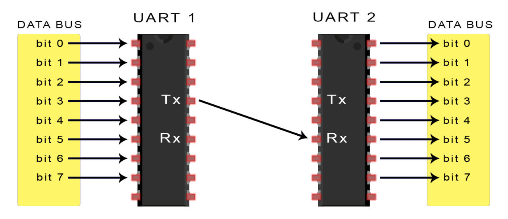

# UART- Shell Access into Router

So, it was my birthday, but I was alone, so there was no celebration or cake cutting. I was bored, so I looked around and saw a router hanging on the wall in my PG room. I became curious, and since I was just beginning into hardware hacking, I figured why not start with it.
I immediately took it out and disassembled it, and I can clearly see that there is UART. Okay, let me try to explain UART for you simply.

  

### UART
<b>UART(Universal Asynchronous Receiver-Transmitter)</b> is one of the most often used communication protocols in embedded devices. It converts the parallel data it receives into a serial bit stream of data that may possibly be interacted with more easily. 
The transmitting UART translates parallel data from a controlling device, such as a CPU, into serial data, which it then sends in serial to the receiving UART, which turns the serial data back into parallel data for the receiving device.

  

UARTs send data asynchronously, which means there is no clock signal to sync the transmitting UART's output of bits with both the receiving UART's sampling of bits. The transmitting UART inserts start and stop bits to the data packet being sent instead of a clock signal. These bits specify the start and end of the data packet, allowing the receiving UART to know when to begin reading the bits.

  

### Let The Game Begin:
As you can see, there are UART pins. But in order to connect to the target, a USB to TTL dongle is required. I took out my "CP2102-Module-Serial-Converter" and wired RX to TX, TX to RX, and GND to GND.

  

Please keep in mind that UART pins are not always labelled, like in my case. In that situation, you can identify the pins with a multimeter or logic analyzer.

  

Next I used "screen" in terminal to communicate by typing `screen /dev/ttyUSB0 9600` and turning on the router. My terminal began receiving random characters as soon as it was switched on, but wait, there's something missing, that's baud-rate. My baud rate (9600) was absolutely incorrect. Trying all of the typical UART rates is a simple technique to get the proper baudrate.

<b>Common Rates:</b> 110, 300, 600, 1200, 2400, 4800, 9600, 14400, 19200, 38400, 57600, 115200, 128000 and 256000.

I tried 9600 first, then 115200, and when I turned the router back on, I see readable text in my terminal. I wait a few minutes to finish the booting process and hit Ctrl+C.

  

That's how I acquired shell access to the router; I reassembled it and kept there as it was without doing further exploitaion. This was my short writup,I hope you enjoyed it reading.
